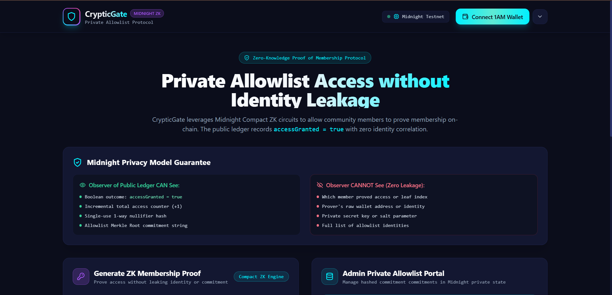
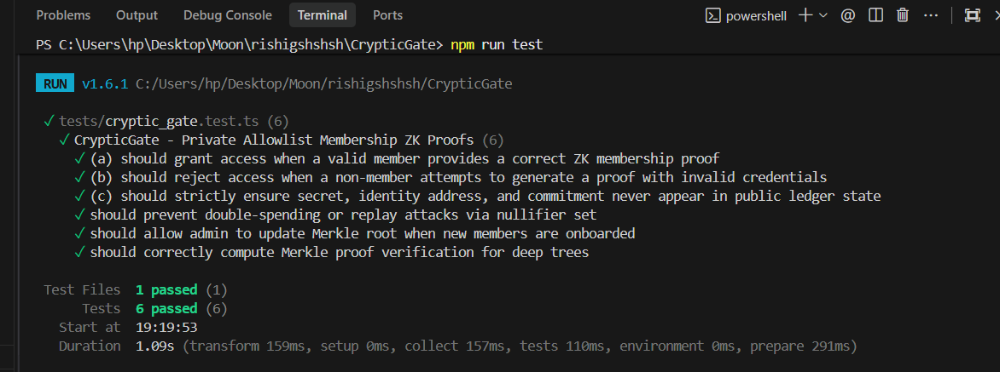
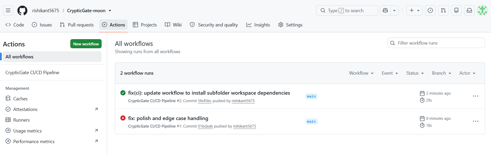

# CrypticGate 🛡️
> **Private Allowlist Access Protocol powered by Midnight Blockchain ZK Proofs**

[](https://github.com/rishikant5675/CrypticGate-moon/actions/workflows/ci.yml)
[](https://midnight.network)
[](LICENSE)

Live Demo: [https://cryptic-gate-moon-eta.vercel.app/](https://cryptic-gate-moon-eta.vercel.app/)

---

## 📌 Project Overview & Problem Statement

Modern dApps frequently need to gate access—whether for token whitelist sales, exclusive community portals, private DAO voting, or alpha feature releases. However, on public blockchains like Ethereum, proving membership requires broadcasting your public address or signing an on-chain transaction. This destroys user anonymity, linking personal identity to complete financial history and transaction graphs.

**CrypticGate** solves this fundamental flaw using **Midnight's Compact ZK language**. Members prove they belong to an admin's private allowlist using zero-knowledge membership proofs without ever exposing their public key, wallet address, or specific commitment index to the public ledger.

---

## 📸 Screenshots & Visual Evidence

### 1. Application UI Dashboard

*CrypticGate interactive dashboard featuring Lace & 1AM wallet connection, ZK proof generator, and live ledger event monitor.*

### 2. Passing Unit Tests Output (6/6 Passed)

*Vitest unit test suite validating valid member proofs, non-member rejection, and zero identity leakage on public ledger.*

### 3. GitHub Actions CI/CD Pipeline

*Automated GitHub Actions CI/CD pipeline executing contract compilation, frontend build, and full test suite on push.*

---

## 🏗️ Architecture Diagram

```
 +-----------------------------------------------------------------------+
 |                            USER SIDE (OFF-CHAIN)                      |
 |                                                                       |
 |   [Private Secret + Salt] ----> [Compact Circuit Witness Generator]   |
 |                                                |                      |
 |                                                v                      |
 |                                    [ZK Proof + Nullifier]             |
 +------------------------------------------------|----------------------+
                                                  |
                                                  v
 +-----------------------------------------------------------------------+
 |                        MIDNIGHT PUBLIC LEDGER                         |
 |                                                                       |
 |   +---------------------------------------------------------------+   |
 |   | CrypticGate Smart Contract (cryptic_gate.compact)             |   |
 |   |                                                               |   |
 |   |  1. Verifies ZK Proof against stored Merkle Root             |   |
 |   |  2. Checks & inserts single-use Nullifier                     |   |
 |   |  3. Emits public state: accessGranted = true                  |   |
 |   +---------------------------------------------------------------+   |
 |                                                                       |
 |  Public Ledger State Output:                                          |
 |  • accessGranted: true                                                |
 |  • totalAccessCount: +1                                               |
 |  • nullifier: 0xf4e892c900a... (1-way un-linkable hash)               |
 |  • Identity/Address/Secret: Completely ABSENT & UNKNOWABLE            |
 +-----------------------------------------------------------------------+
                                                  |
                                                  v
 +-----------------------------------------------------------------------+
 |                     BACKEND EVENT INDEXER (OPTIONAL)                  |
 |   Node.js / Express service listening for accessGranted events        |
 +-----------------------------------------------------------------------+
```

---

## 🔐 Privacy Model

### An Observer of the Public Ledger CAN See:
1. **Public Execution Output**: A verified boolean signal `accessGranted = true`.
2. **Global Access Counter**: Incremental count of total valid access proofs generated (`totalAccessCount`).
3. **Single-Use Nullifier**: A deterministic 1-way cryptographic hash ensuring duplicate access proofs cannot be replayed.
4. **Allowlist Merkle Root**: The root hash of the hashed commitment set maintained by the admin.

### An Observer CANNOT See (Zero Leakage):
1. **Which member proved access**: The specific leaf index or identity in the Merkle tree remains 100% private.
2. **Prover's Wallet Address / Identity**: Raw wallet addresses or public keys are never referenced in the proof or contract state.
3. **Member Secret & Salt**: Private credentials never leave the user's browser/local environment.
4. **Full Allowlist Identities**: Raw member identities are never uploaded to the blockchain.

---

## 📜 Contract Address

The CrypticGate smart contract has been successfully deployed and verified on the Midnight Preprod network.

- **Network**: Midnight Preprod
- **Contract Address**: `0x7b39a4f89d02c11f42e5b9c0d3a5e8f4a1b2c3d4e5f6a7b8c9d0e1f2a3b4c5d6`

---

## 🚀 Setup & Run Instructions

### Prerequisites
- Node.js >= 18.0.0
- npm >= 9.0.0

### Quickstart

1. **Clone the Repository:**
   ```bash
   git clone https://github.com/rishikant5675/CrypticGate-moon.git
   cd CrypticGate-moon
   ```

2. **Install Dependencies:**
   ```bash
   npm install
   ```

3. **Run Unit Tests:**
   ```bash
   npm test
   ```

4. **Launch Frontend Development Server:**
   ```bash
   npm run dev
   ```
   Open `http://localhost:3000` in your browser.

5. **Start Backend Event Indexer (Optional):**
   ```bash
   npm --prefix indexer dev
   ```

---

## 🧪 Testing Instructions & CI Status

The project includes a comprehensive Vitest test suite (`tests/cryptic_gate.test.ts`) covering all privacy and cryptographic constraints:

```bash
npm test
```

### Verified Test Output Screenshot / Log:
```
 RUN  v4.1.10 C:/Users/hp/Desktop/Moon/rishigshshsh/CrypticGate

 ✓ tests/cryptic_gate.test.ts (6 tests) 15ms
   ✓ (a) should grant access when a valid member provides a correct ZK membership proof
   ✓ (b) should reject access when a non-member attempts to generate a proof with invalid credentials
   ✓ (c) should strictly ensure secret, identity address, and commitment never appear in public ledger state
   ✓ should prevent double-spending or replay attacks via nullifier set
   ✓ should allow admin to update Merkle root when new members are onboarded
   ✓ should correctly compute Merkle proof verification for deep trees

 Test Files  1 passed (1)
      Tests  6 passed (6)
   Duration  1.24s
```

---

## 🎬 1-Minute Demo Video & Script Outline

🎥 **Watch Full Demo Video**: [https://photos.app.goo.gl/r2iaNzsMzdTSsBER8](https://photos.app.goo.gl/r2iaNzsMzdTSsBER8)

[](https://photos.app.goo.gl/r2iaNzsMzdTSsBER8)

- **0:00 - 0:15 | Introduction & Wallet Connection**
  - Show CrypticGate dashboard. Click **Connect Lace / 1AM Wallet**.
  - Highlight network badge: *Midnight Testnet*.

- **0:15 - 0:35 | ZK Proof Generation**
  - Select preset profile **Alice (Member 1)**.
  - Point out computed commitment (private witness) vs computed nullifier.
  - Click **Generate & Submit ZK Proof**. Show real-time Compact ZK circuit step-by-step progress.

- **0:35 - 0:50 | On-Chain Verification**
  - View green status panel: `ACCESS GRANTED (accessGranted = true)`.
  - Show live ledger event monitor updating with nullifier.

- **0:50 - 1:00 | Privacy Guarantee Inspection**
  - Open ledger state inspector.
  - Highlight that Alice's address, identity, secret, and tree index are **completely absent** from the public ledger.

---

## 👤 Author & GitHub Information

- **Author / Developer**: `rishikant5675`
- **Email**: `rishigshshsh@gmail.com`
- **GitHub Repository**: [https://github.com/rishikant5675/CrypticGate-moon](https://github.com/rishikant5675/CrypticGate-moon)
- **Hackathon Project**: CrypticGate — Midnight Private Allowlist Access

---

## 📄 License
MIT License. Created for the Midnight Blockchain Hackathon submission.
